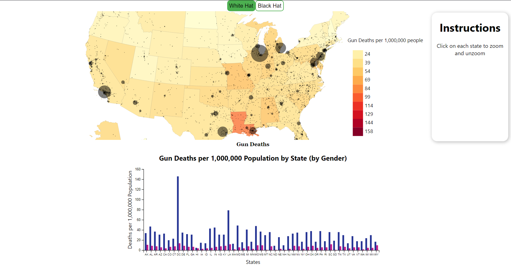

## Introduction
Data Visualization is a powerful tool in understanding and representing data. But it can be misused to create misunderstanding, misinterpretation and manipulation of the information. Some of the ways found in the Black Hat part of this project are distorted scales, poor color scheme and misrepresentation of the data. I tried to counter these issues in my attempt to represent the information to its true meaning in an unbiased manner.

## Solutions

#### Whitehat.js
1. I changed to the color palette to make it color-blind friendly.
2. I normalized the death counts for each states by its population into a metric called deaths per million for better representation.
3. I scaled the circles representing deaths as per the area.
4. I added tooltips to show city data.

#### WhiteHatStats.js
1. I added a comparative bar graph to better understand the deaths among males and females across states for gender-based analysis.

## References
1. States Map: https://eric.clst.org/tech/usgeojson/
2. US Census Data: https://www.census.gov/data/tables/time-series/demo/popest/2010s-state-total.html
3. US Slate Gun Violence Dataset: https://www.slate.com/articles/news_and_politics/crime/2012/12/gun_death_tally_every_american_gun_death_since_newtown_sandy_hook_shooting.html

## Screenshots
